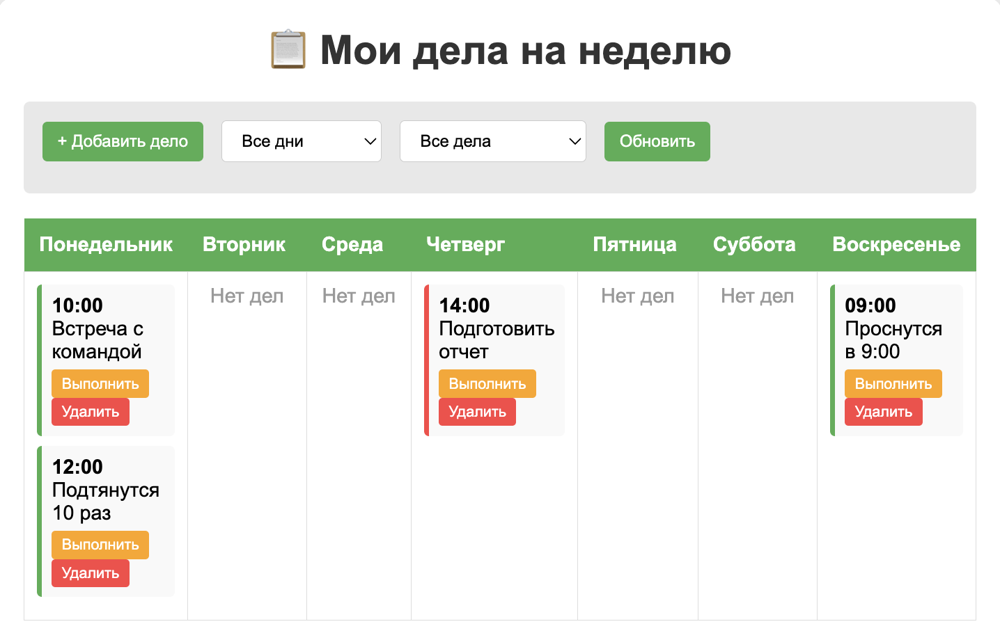

# Таблица дел на неделю - Express.js приложение


Full-stack приложение для управления задачами на неделю с использованием Express.js.
screenshot - ./photo
##  Функциональность

-  Добавление, редактирование, удаление задач
-  Фильтрация по дню недели и статусу выполнения
-  Отметка задач как выполненных
-  Приоритет задач (высокий, средний, низкий)
-  RESTful API для работы с задачами
-  Адаптивный веб-интерфейс

## 📱 **Навигация по сайту**


### **Главная страница**
URL: http://localhost:3000

**Что можно сделать:**
- Просмотреть все дела на неделю
- Видеть задачи по дням в таблице
- Отмечать выполненные задачи
- Удалять задачи

### **API Endpoints (для разработчиков)**

#### **1. Получить все задачи**
```bash
# Браузер:
http://localhost:3000/api/todos

# Фильтр по дню:
http://localhost:3000/api/todos?day=Понедельник

# Фильтр по статусу:
http://localhost:3000/api/todos?completed=true
http://localhost:3000/api/todos?completed=false

# Фильтр по приоритету:
http://localhost:3000/api/todos?priority=high

#Получить задачи по конкретному дню
# Браузер:
http://localhost:3000/api/todos/day/Понедельник
http://localhost:3000/api/todos/day/Вторник
http://localhost:3000/api/todos/day/Среда
http://localhost:3000/api/todos/day/Четверг
http://localhost:3000/api/todos/day/Пятница
http://localhost:3000/api/todos/day/Суббота
http://localhost:3000/api/todos/day/Воскресенье

#Получить задачу по ID
# ID 1, 2, 3 и т.д.:
http://localhost:3000/api/todos/1
http://localhost:3000/api/todos/2
http://localhost:3000/api/todos/3

#Создать новую задачу
# Terminal (curl):
curl -X POST http://localhost:3000/api/todos \
  -H "Content-Type: application/json" \
  -d '{
    "day": "Понедельник",
    "task": "Новая задача",
    "time": "10:00",
    "priority": "medium"
  }'


  # Обновить задачу с ID 1:
curl -X PUT http://localhost:3000/api/todos/1 \
  -H "Content-Type: application/json" \
  -d '{
    "task": "Обновленная задача",
    "completed": true
  }'

  # Удалить задачу с ID 1:
curl -X DELETE http://localhost:3000/api/todos/1

# Переключить статус задачи с ID 1:
curl -X PATCH http://localhost:3000/api/todos/1/toggle

# Установка
git clone https://github.com/SherelW/todoAPP.git
cd todoAPP
npm install
npm run dev